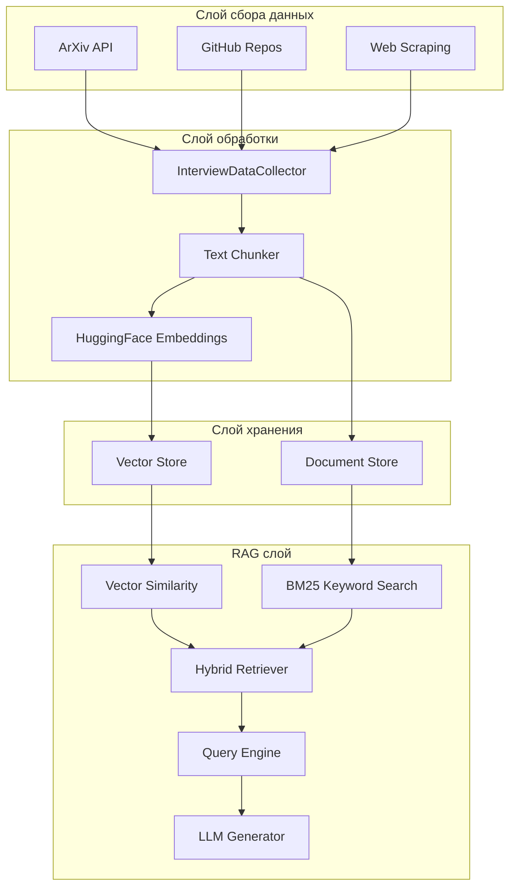

# LLM RAG Challenge

Курсовая работа по курсу "Введение в LLM" (AITH). Проект реализует RAG-систему (Retrieval-Augmented Generation) для подготовки к собеседованиям, способную собирать научные статьи и генерировать учебные материалы на основе собранных знаний.

## Архитектура

### Обзор пайплайна



### Описание компонентов

| Компонент | Файл | Описание |
|-----------|------|----------|
| `InterviewDataCollector` | `src/processing/gather.py` | Собирает материалы из ArXiv, GitHub-репозиториев и веб-источников. Расширяет запросы до связанных тем и фильтрует по релевантности. |
| `InterviewIndexer` | `src/processing/index.py` | Строит векторные индексы из собранных документов с помощью LlamaIndex. Использует HuggingFace эмбеддинги. |
| `HybridRetriever` | `src/processing/rag.py` | Комбинирует векторный поиск по схожести с BM25 поиском по ключевым словам. Настраиваемые веса для каждого метода. |
| `InterviewRAGService` | `src/processing/rag.py` | Обрабатывает поиск и генерацию. Использует гибридный поиск и генерирует структурированные учебные материалы. |
| `RAGEvaluator` | `src/evaluation/evaluate.py` | Комплексная оценка с метриками поиска, RAGAS и человеческой оценкой. |

### Поток данных

1. **Сбор**: Пользователь указывает запрос (например, "system design interview"). Коллектор расширяет его до связанных тем и получает материалы из настроенных источников.
2. **Индексация**: Собранные документы разбиваются на чанки (512 токенов, перекрытие 50) и преобразуются в эмбеддинги с помощью HuggingFace `BAAI/bge-small-en-v1.5`.
3. **Хранение**: Эмбеддинги сохраняются в векторное хранилище; оригинальные документы — в хранилище документов (оба сохраняются в `data/processed/`).
4. **Поиск**: Гибридный поиск комбинирует:
   - **Векторный поиск**: схожесть эмбеддингов запроса (вес 70%)
   - **BM25**: поиск по ключевым словам (вес 30%)
5. **Генерация**: Найденный контекст передаётся в LLM (по умолчанию: `mistral-large-latest`) для генерации структурированного учебного материала.

### Конфигурация

Все настройки управляются через `config.yaml`:

```yaml
gather:
  data_dir: "data/raw"
  max_results: 4
  include_sources: ["arxiv", "github", "web"]

index:
  persist_dir: "data/processed"
  chunk_size: 512
  chunk_overlap: 50

rag:
  similarity_top_k: 5
  llm_model: "mistral-large-latest"
  temperature: 0.1
  bm25_weight: 0.3      # Вес для поиска по ключевым словам
  vector_weight: 0.7    # Вес для векторного поиска
```

## Установка

Проект использует `uv` для управления зависимостями.

### 1. Установка зависимостей

Убедитесь, что у вас установлен `uv`, затем синхронизируйте зависимости:

```bash
uv sync
```

### 2. Настройка окружения

Создайте файл `.env` из примера:

```bash
cp env.example .env
```

Отредактируйте файл `.env`, добавив ваши API-ключи.

**Переменные окружения:**
- `MISTRAL_API_KEY`: Обязателен для LLM (Mistral AI).
- `MISTRAL_MODEL_NAME`: Название модели (по умолчанию: `mistral-large-latest`).
- Эмбеддинги по умолчанию используют локальную модель HuggingFace (`BAAI/bge-small-en-v1.5`), поэтому API-ключ для индексации не требуется.

## Использование

Проект предоставляет CLI через `main.py`:

### Подготовка материалов для собеседования

Запуск полного пайплайна (сбор → индексация → генерация) для темы:

```bash
uv run python main.py --query "system design interview" --guide
```

### Быстрый режим

Используйте `--quick` для более быстрых результатов с меньшим количеством источников:

```bash
uv run python main.py --query "algorithms" --guide --quick
```

### Экспорт в JSON

Сохранение результатов в формате JSON:

```bash
uv run python main.py --query "machine learning" --guide --json
```

### Запуск оценки

Оценка RAG-системы на валидационном наборе данных:

```bash
uv run python -m src.evaluation.evaluate
```

Для человеческой оценки:

```bash
uv run python -m src.evaluation.evaluate --human
```

## Результаты оценки

### Базовая производительность (гибридный поиск)

Оценка проведена на 25 запросах из валидационного набора (`data/evaluation/validation_set.json`).

#### Метрики поиска

| Метрика | Значение | Описание |
|---------|----------|----------|
| **MRR** | 0.960 | Mean Reciprocal Rank — релевантный документ обычно находится первым |
| **Precision@3** | 0.347 | 35% результатов из топ-3 являются точными совпадениями |
| **Recall@3** | 0.940 | 94% ожидаемых документов найдено в топ-3 |
| **Precision@5** | 0.208 | Точность снижается при большем k (ожидаемо) |
| **Recall@5** | 0.940 | Высокая полнота сохраняется |
| **Recall@10** | 0.940 | Стабильная полнота при разных значениях k |

#### Интерпретация метрик

- **Высокий MRR (0.96)**: Система почти всегда возвращает наиболее релевантный документ первым, что указывает на отличное качество ранжирования.
- **Высокая полнота (0.94)**: Система успешно находит 94% ожидаемых документов, демонстрируя хорошее покрытие.
- **Низкая точность**: Ожидаемое поведение — точность снижается при увеличении k, так как мы извлекаем больше документов, чем минимальный набор ожидаемых источников. Это приемлемо, поскольку цель — полное покрытие.

#### Преимущества гибридного поиска

Гибридный подход (70% векторный + 30% BM25) обеспечивает:
- Семантическое понимание от векторных эмбеддингов
- Точное совпадение ключевых слов от BM25
- Лучшую обработку технической терминологии и специфических фраз

## Зависимости

| Пакет | Назначение |
|-------|------------|
| `llama-index` | Основной RAG-фреймворк |
| `llama-index-llms-mistralai` | Интеграция с Mistral AI LLM |
| `llama-index-embeddings-huggingface` | Локальные HuggingFace эмбеддинги |
| `llama-index-readers-file` | Парсинг документов (PDF и др.) |
| `arxiv` | Клиент ArXiv API |
| `python-dotenv` | Управление переменными окружения |
| `rank-bm25` | BM25 поиск по ключевым словам |
| `ragas` | Фреймворк для оценки RAG |

## Структура проекта

```
llm-rag-challenge/
├── main.py                      # CLI точка входа
├── config.yaml                  # Конфигурация пайплайна
├── pyproject.toml               # Зависимости (uv)
├── src/
│   ├── processing/
│   │   ├── gather.py            # Сбор данных
│   │   ├── index.py             # Индексация и эмбеддинги
│   │   └── rag.py               # Гибридный поиск и генерация
│   └── evaluation/
│       └── evaluate.py          # Метрики оценки и запуск
└── data/
    ├── raw/                     # Исходные документы (PDF)
    ├── processed/               # Векторное хранилище и индексы
    └── evaluation/
        ├── validation_set.json  # Тестовые запросы и ground truth
        └── results/             # Результаты оценки
```
